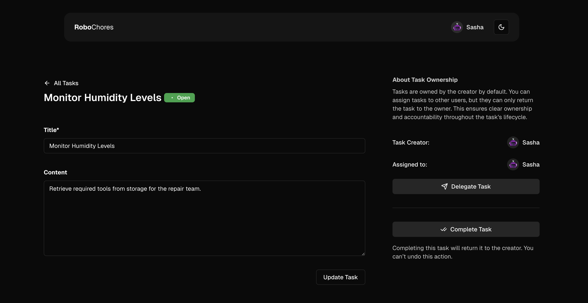
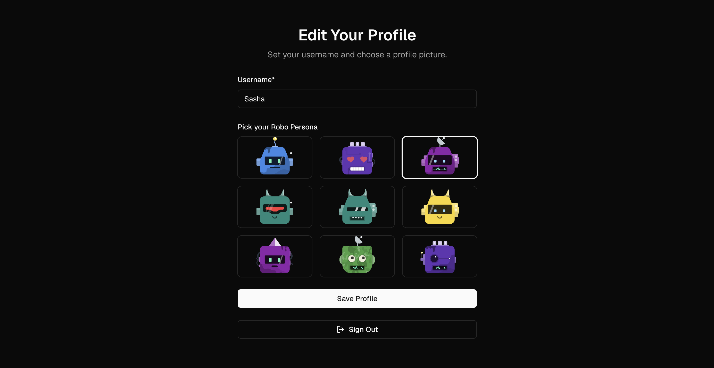

# RoboChores

A task management system for robots, created as part of the React Workshop at [Swiss Life (Schweiz)](https://www.swisslife.ch/).





---

## 🚀 How to Run

There are two options to run this project: either on StackBlitz or locally on your machine. Note: we cannot assist you with setting up your local machine (Git, Node.js, Yarn, VSCode).

### 🖥️ Option 1: Run on StackBlitz

1. Open this repository on StackBlitz using [this link](https://stackblitz.com/~/github.com/christophbuehler/react-workshop).
2. Fork the project (top-left corner) to save your changes, though it’s not strictly required for the workshop as StackBlitz persists changes in your browser session.
3. Install recommended extensions if prompted.
4. You should now see the RoboChores login screen.
5. Open this README file in StackBlitz, and you’re ready to start! 🎉

### 💻 Option 2: Run Locally

1. **Prerequisites**: Make sure you have the following installed:
   - [Git](https://git-scm.com/)
   - [Node.js](https://nodejs.org/)
   - [Yarn](https://yarnpkg.com/)

2. **Clone the repository**:
   ```bash
   git clone git@github.com:christophbuehler/react-workshop.git
   ```

3. **Generate the SDK for VSCode (optional)**:
   ```bash
   yarn dlx @yarnpkg/sdks vscode
   ```

4. **Install dependencies**:
   ```bash
   yarn install
   ```

5. **Start the development server**:
   ```bash
   yarn dev
   ```

---

## 🛠️ Tech Stack

- [**Firebase**](https://firebase.google.com/) with [Firestore Database](https://firebase.google.com/products/firestore)
- [**Next.js 15.1**](https://nextjs.org/docs) with **App Router**
- [**React 19**](https://react.dev/)
- [**shadcn Component Library**](https://ui.shadcn.com/)
- [**Tailwind CSS**](https://tailwindcss.com/)

---

# 🖧 Server Setup

> This section is for the host and is not part of the React Workshop. The host is responsible for providing a running backend instance.

**1. Install Firebase CLI**:
   ```bash
   npm install -g firebase-tools
   ```

**2. Log in to Firebase**:
   ```bash
   firebase login
   ```

**3. Initialize a Firebase project**:
   ```bash
   firebase init
   ```

   During initialization:
   - Select nothing to create an empty project.
   - Create a new project.
   - Enter a unique project ID.

**4. Set up Cloud Firestore**:
   Navigate to your project in [the Firebase Console](https://console.firebase.google.com/). Under Firestore Database, click "Create Database":
   1. Use the default name and choose a preferred location.
   2. Create a test database.

**5. Enable Anonymous Authentication**:
   Enable email authentication in the Firebase Console.

**6. Add a Web App**:
   In the Firebase Console, create a new Web App for your project:
   1. Choose a name (hosting is not needed).
   2. Click "Register."
   3. Copy the Firebase config snippet and paste it into `src/lib/firebase-config.ts`. (This data is public, so no worries!)

---

With these instructions, you should be ready to start building and running RoboChores! 🚀
